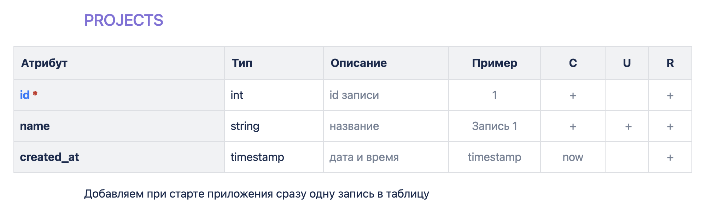
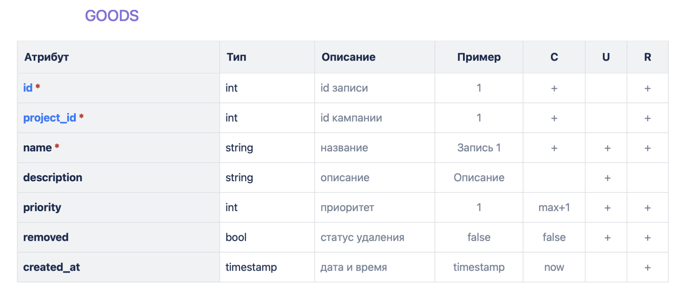
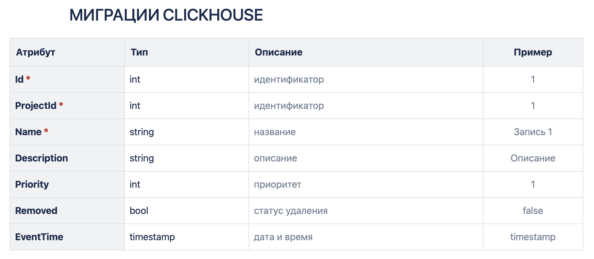
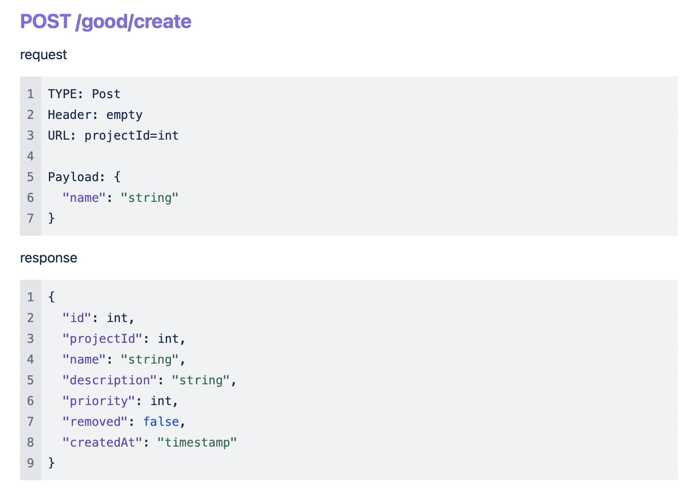
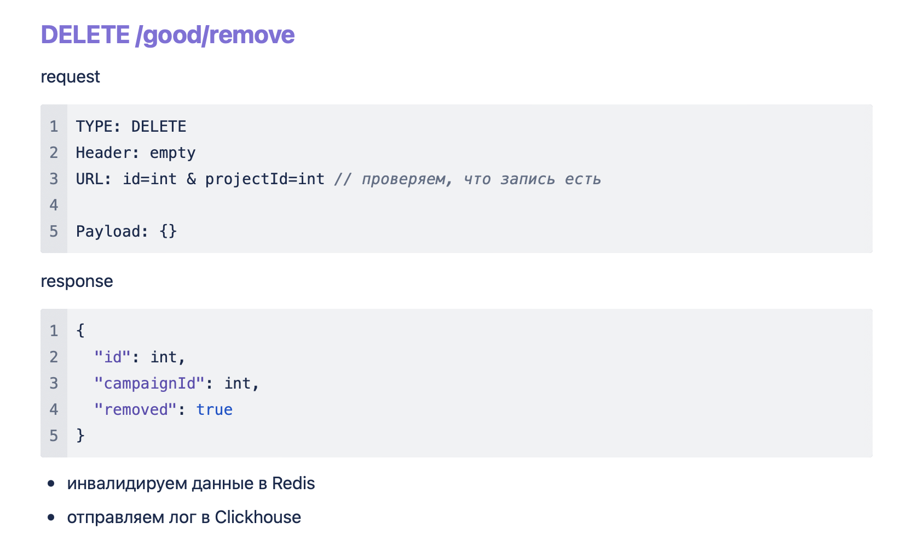
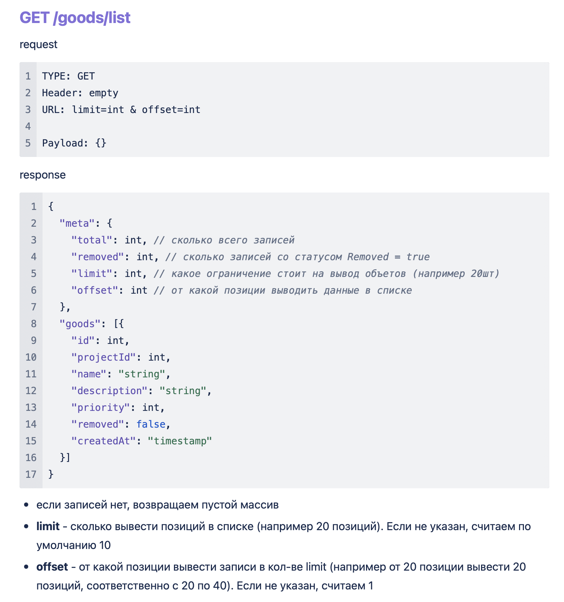
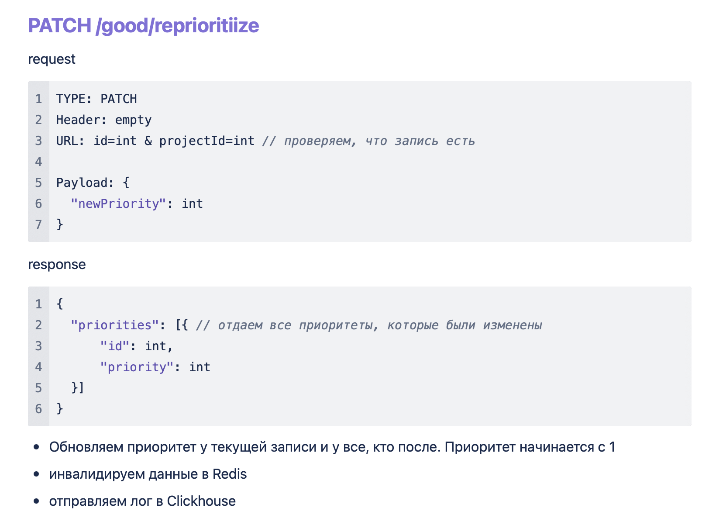

## ЗАДАЧА

1. - [ ] Развернуть сервис на Golang, Postgres, Clickhouse, Nats (альтернатива kafka), Redis
2. - [ ] Описать модели данных и миграций
3. - [ ] В миграциях Postgres
    1. - [ ] Проставить primary-key и индексы на указанные поля
    2. - [ ] При добавлении записи в таблицу устанавливать приоритет как макс приоритет в таблице +1. Приоритеты начинаются с 1
    3. - [ ] При накатке миграций добавить одну запись в Projects таблицу по умолчанию
        1. id = serial
        2. name = Первая запись
4. - [ ] Реализовать CRUD методы на GET-POST-PATCH-DELETE данных в таблице GOODS в Postgres
5. - [ ] При редактировании данных в Postgres ставить блокировку на чтение записи и оборачивать все в транзакцию. Валидируем поля при редактировании.
6. - [ ] При редактировании данных в GOODS инвалидируем данные в REDIS
7. - [ ] Если записи нет (проверяем на PATCH-DELETE), выдаем ошибку (статус 404)
    1. code = 3
    2. message = “errors.good.notFound“
    3. details = {}
8. - [ ] При GET запросе данных из Postgres кешировать данные в Redis на минуту. Пытаемся получить данные сперва из Redis, если их нет, идем в БД и кладем их в REDIS
9. - [ ] При добавлении, редактировании или удалении записи в Postgres писать лог в Clickhouse через очередь Nats (альтернатива kafka). Логи писать пачками в Clickhouse
10. - [ ] При обращении в БД использовать чистый SQL

## МИГРАЦИИ POSTGRES

1. Синий цвет - primary key
2. \* - индекс параметры
3. C - создание
4. U - обновление
5. R - обязательное поле или нет при редактировании

## REST Методы

